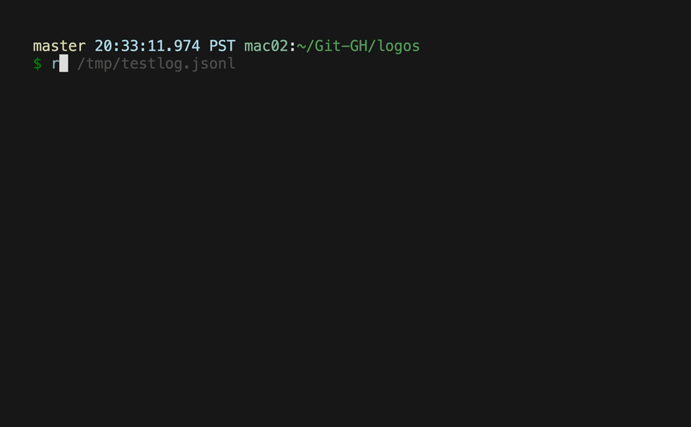
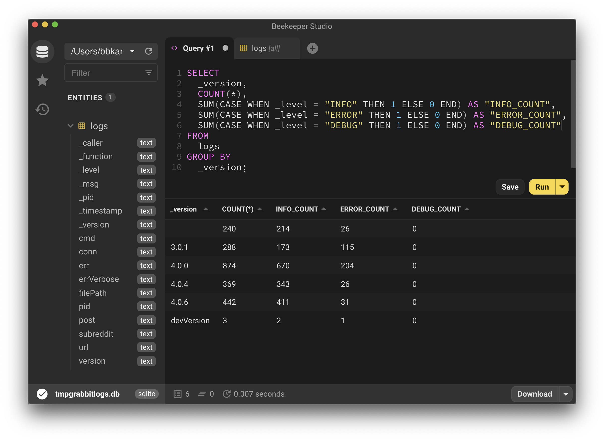

# logos

***Logging + Printing + Compromising***

logos is a small and super-opinionated wrapper around [`go.uber.org/zap`](https://pkg.go.dev/go.uber.org/zap?utm_source=godoc) to:

- give users decent looking output
- give auditors structured logs to analyze
- give developers an easy way to print and log with the same function call



## Usage

A call to a `logos.Logger` looks like:

```go
logger.Infow(
    "Now we're logging :)",
    "key", "value",
    "otherkey", "othervalue",
)
```

This produces a `stdout` output of:

```
INFO: Now we're logging :)
  key: "value"
  otherkey: "othervalue"
```

Assuming `NewZapSugaredLogger` is used to create the logger,
this `logger.Infow` call produces this log line:

```json
{"_level":"INFO","_timestamp":"2021-06-08T22:16:29.161-0700","_caller":"logos/example_logos_test.go:21","_function":"github.com/bbkane/logos_test.Example","_msg":"Now we're logging :)","_pid":49721,"_version":"v1.0.0","key":"value","otherkey":"othervalue"}
```

Note that logos can wrap any `zap.Logger`, the provided `NewZapSugaredLogger` is only a convenience function.

See the [pkg.go.dev docs](https://pkg.go.dev/github.com/bbkane/logos) for the exact API and example usage.

## When to use

logos *might* be useful for small CLI apps that need logs

logos *won't* be useful for performance sensitive apps (no attention paid to allocation, unbuffered prints), apps designed to produce output for piping to another command, or apps producing deeply nested logs.

logos is imported by [these open-source packages](https://pkg.go.dev/github.com/bbkane/logos?tab=importedby).

## Philosophy

`logos` users (i.e., the author 😃)  believe only 3 log levels are needed:

- `DEBUG` for information only needed by auditors looking at the logs
- `ERROR` for problems
- `INFO` for other information

Correspondingly, logos offers the following functions and destinations for their content:

|                 | stderr | stdout | logfile |
| --------------- | :----: | :----: | :-----: |
| `Logger.Debugw` |        |        |    x    |
| `Logger.Errorw` |   x    |        |    x    |
| `Logger.Infow`  |        |   x    |    x    |

The logger methods are a subset of `zap.SugaredLogger`.

In addition, logos offers `Logger.Sync` to sync the logs and `Logger.LogOnPanic` as an optional function to `recover` from a panic, log, and then panic again.

## Analyzing JSON Logs

The great thing about structured JSON logs is you can use powerful tools to analyze them. Let's analyze the logs for my local installation of [`grabbit`](https://github.com/bbkane/grabbit). `grabbit` stores its logs in `~/.config/grabbit.jsonl`

### Analyze as JSON

Select the last error using [`jq`](https://stedolan.github.io/jq/):

```bash
jq -s 'map(select(._level == "ERROR")) | reverse | limit(1;.[])' ~/.config/grabbit.jsonl
```

```json
{
  "_level": "ERROR",
  "_timestamp": "2021-06-07T12:51:23.023-0700",
  "_caller": "grabbit/main.go:277",
  "_function": "main.grab",
  "_msg": "can't download image",
  "_pid": 33557,
  "_version": "4.0.6",
  "subreddit": "wallpapers",
  "post": "Your Name ( Kimi No Na Wa ) Screens [1080P upscaled to 4K]",
  "url": "https://www.reddit.com/gallery/nqwe27",
  "err": "urlFileName doesn't end in allowed extension: \"nqwe27\" , []string{\".jpg\", \".jpeg\", \".png\"}\n ",
  "errVerbose": "urlFileName doesn't end in allowed extension: \"nqwe27\" , []string{\".jpg\", \".jpeg\", \".png\"}\n \nmain.validateImageURL\n\t/home/runner/work/grabbit/grabbit/main.go:198\nmain.grab\n\t/home/runner/work/grabbit/grabbit/main.go:275\nmain.run\n\t/home/runner/work/grabbit/grabbit/main.go:416\nmain.main\n\t/home/runner/work/grabbit/grabbit/main.go:429\nruntime.main\n\t/opt/hostedtoolcache/go/1.16.2/x64/src/runtime/proc.go:225\nruntime.goexit\n\t/opt/hostedtoolcache/go/1.16.2/x64/src/runtime/asm_amd64.s:1371"
}
```

Other tools  (most of which I haven't tried) to analyze  JSON  include [`ax`](https://github.com/egnyte/ax), [`fblog`](https://github.com/brocode/fblog), [`jiq`](https://github.com/fiatjaf/jiq), [`jsonui`](https://github.com/gulyasm/jsonui)  , [`jql`](https://github.com/cube2222/jql), and [`jid`](https://github.com/simeji/jid).

### Analyze as CSV

I wrote a small Python script I call [jsonl_to.py](https://github.com/bbkane/dotfiles/blob/master/bin_common/bin_common/jsonl_to.py) to convert line-delimited JSON (`.jsonl`) to CSV for analysis in Google Sheets or similar programs. Here's my grabbit log for perusal [in Google Sheets](https://docs.google.com/spreadsheets/d/1FUA8kWBhkAr1eyaZZ0selVuVv-J6nilovCQz9HEUDkk/edit?usp=sharing).

That CSV was generated with:

```bash
jsonl_to.py -f csv ~/.config/grabbit.jsonl > ~/tmp.csv
```

### Analyze as SQLite3

Of course, SQLite3 can also [import CSVs](https://unix.stackexchange.com/a/638984/185953), and then it's possible to analyze logs with any SQLite3 tool. SQLite3 tools I like are the SQLite3 shell, [litecli](https://github.com/dbcli/litecli), [Beekeeper Studio](https://www.beekeeperstudio.io/), and [DbGate](https://dbgate.org/).

```bash
jsonl_to.py -f csv ~/.config/grabbit.jsonl \
| sqlite3 ~/tmpgrabbitlogs.db '.import --csv /dev/stdin logs'
```



## History

logos began as a set of functions in [`grabbit`](https://github.com/bbkane/grabbit), so I could have a log of failed image downloads to analyze. Eventually I extracted it into [`sugarkane`](https://github.com/bbkane/sugarkane) to use in other apps. Finally, I reworked the API and released logos.
